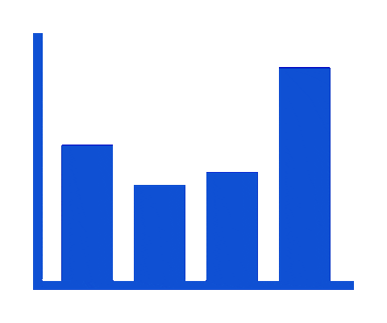

#  Overview 

*  : I'm from Haiduong, Vietnam
* 🎒 : Learning IT at **<a style="color: red" href="https://hust.edu.vn/" target="_blank">HUST</a>** (2018-now)
* ❤️ : Passionate about:
    - 💻 Web Development
    - 🎮 PES
    - 🎨 Graphic Design

 

#  Skills 
 &nbsp;
 &nbsp;

 &nbsp;
 &nbsp;
 &nbsp;
 &nbsp;

 &nbsp;
 &nbsp;

 &nbsp;
 &nbsp;
 &nbsp;

 

#  Experiences 
<!--  &nbsp;
 &nbsp; -->

* 06/2023 - present : **<a style="color: yellow" href="https://www.misa.vn/" target="_blank">Misa JSC, Hanoi</a>**

* 08/2022 - 10/2022 : **<a style="color: red" href="https://rikkeisoft.com/" target="_blank">Rikkeisoft, Hanoi</a>**

 

#  Contact 

